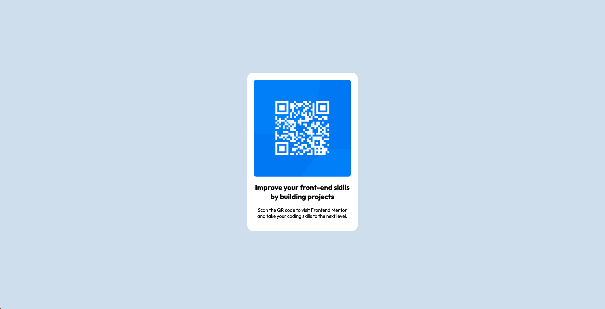

## Frontend Mentor - QR code component solution

This is a solution to the [QR code component challenge on Frontend Mentor](https://www.frontendmentor.io/challenges/qr-code-component-iux_sIO_H). Frontend Mentor challenges help you improve your coding skills by building realistic projects. 

### Table of contents

- [Overview](#overview)
  - [Screenshot](#screenshot)
  - [Links](#links)
- [My process](#my-process)
  - [Built with](#built-with)
  - [What I learned](#what-i-learned)
  - [Useful resources](#useful-resources)
- [Author](#author)
- [Acknowledgments](#acknowledgments)

### Overview
A card component that uses a QR code to point to the Frontend Mentor site, and gives a brief description of the site.

### Screenshot

### Links

- Solution URL: [https://github.com/rachelpr/qr-component](https://github.com/rachelpr/qr-component)
- Live Site URL: [https://rachelpr.github.io/qr-component/](https://rachelpr.github.io/qr-component/)

### My process
1. First I wrote the index.html, using semantic HTML tags as much as possible
2. From here I wrote the basis of my layout.css stylesheet, with the known styles
3. After this I spent most of my time re-configuring the styles from the browser dev tools as this helped me play around until I found the right one.
4. I then showed my solution and the mock-ups to other people for a critical eye that wasn't my own

### Built with

- Semantic HTML5 markup
- CSS custom properties
- Flexbox
- Mobile-first workflow

### What I learned

- Downside to using the dev tools to style is accidentally forgetting to take the stylesheet from the dev console and apply them to your project stylesheet

### Useful resources

- [Aligning Items in a Flex Container](https://developer.mozilla.org/en-US/docs/Web/CSS/CSS_Flexible_Box_Layout/Aligning_Items_in_a_Flex_Container) - MDN resource for aligning items with Flexbox, always a good read! 
- [Chrome DevTools](https://developer.chrome.com/docs/devtools/) - A good resource for mastering the Chrome DevTools

### Author

- Frontend Mentor - [@rachelpr](https://www.frontendmentor.io/profile/rachelpr)
- Github - [@rachelpr](https://github.com/rachelpr)

### Acknowledgments

Quick shoutout to a couple folks that helped review my project:
- [@blu3too](https://github.com/b1u3too)
- [@MGS31](https://github.com/MGS31)
